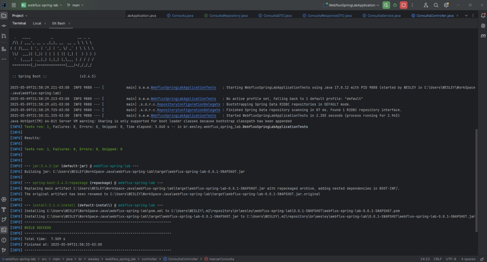
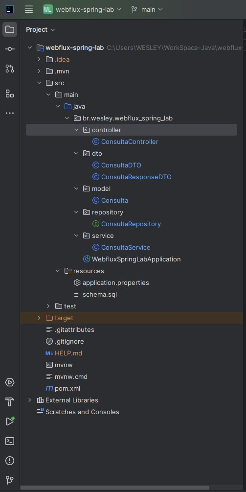
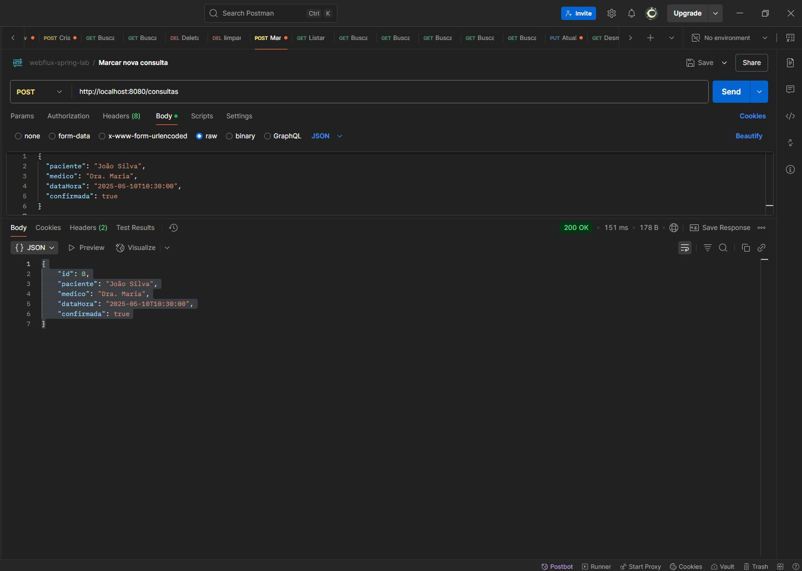
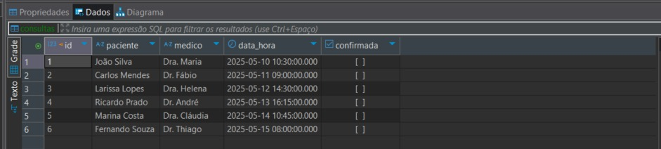

# ⚡ webflux-spring-lab

Projeto didático desenvolvido com **Spring WebFlux**, **R2DBC**, **PostgreSQL** e **Reactor**, simulando um sistema de agendamento de consultas médicas. O objetivo principal é estudar e aplicar conceitos reativos com persistência assíncrona, além de explorar uma arquitetura limpa com DTOs, Services e Repositories.

---

## 📚 Objetivo

Permitir o cadastro, listagem, atualização, exclusão e filtro de **consultas médicas**, utilizando programação reativa com Spring WebFlux e persistência não bloqueante via R2DBC.

---

## 🚀 Tecnologias Utilizadas

- Java 17  
- Spring Boot 3.4.5  
- Spring WebFlux  
- Spring Data R2DBC  
- PostgreSQL  
- R2DBC PostgreSQL Driver  
- Project Reactor  
- Maven  
- Postman  
- DBeaver  
- IntelliJ IDEA  
- Git & GitHub  

---

## 🗂️ Estrutura do Projeto

```
src/
├── main/
│   ├── java/
│   │   └── br/wesley/webflux_spring_lab/
│   │       ├── controller/
│   │       ├── dto/
│   │       ├── model/
│   │       ├── repository/
│   │       ├── service/
│   │       └── WebfluxSpringLabApplication.java
│   └── resources/
│       ├── application.properties
│       └── schema.sql
```

---

## 🛠️ Criação do Banco de Dados e da Tabela

### 1. Acesse o PostgreSQL

```bash
psql -U postgres
```

### 2. Crie o banco de dados

```sql
CREATE DATABASE webflux-spring-lab_db;
```

> O nome precisa ser exatamente esse: `webflux-spring-lab_db`

### 3. Tabela de consultas (criada automaticamente)

```sql
CREATE TABLE IF NOT EXISTS consulta (
    id SERIAL PRIMARY KEY,
    paciente VARCHAR(100) NOT NULL,
    medico VARCHAR(100) NOT NULL,
    data_hora TIMESTAMP NOT NULL,
    confirmada BOOLEAN DEFAULT FALSE
);
```

Esse script já está em `src/main/resources/schema.sql`.

---

## ▶️ Como Executar Localmente

```bash
mvn clean install
mvn spring-boot:run
```

Acesse o sistema:
```
http://localhost:8080/consultas
```

---

## 🧪 Testes com Postman

### Exemplo de requisição `POST`:

```json
{
  "paciente": "João Silva",
  "medico": "Dra. Maria",
  "dataHora": "2025-05-10T10:30:00",
  "confirmada": true
}
```

---

## 🖼️ Prints do Projeto

### ✅ Execução da Aplicação no Terminal

Demonstração da build bem-sucedida e inicialização com Netty.



---

### 🧠 Estrutura do Projeto no IntelliJ IDEA

Organização por camadas com pacote-base `br.wesley.webflux_spring_lab`.



---

### 📬 Requisição POST via Postman

Enviando os dados da consulta com sucesso e obtendo resposta `200 OK`.



---

### 🗄️ Dados Persistidos no DBeaver

Tabela `consulta` criada corretamente e preenchida com os dados vindos da API.



---

## ✅ Funcionalidades

- [x] Criar nova consulta  
- [x] Listar todas as consultas  
- [x] Buscar por ID, paciente, médico ou data  
- [x] Filtrar por status de confirmação  
- [x] Atualizar data de consulta  
- [x] Desmarcar (deletar) consulta  
- [x] Buscar por múltiplos critérios  

---

## 🧠 Conceitos Trabalhados

- Programação reativa com Spring WebFlux  
- Acesso não bloqueante a banco de dados com R2DBC  
- Uso de `Flux` e `Mono`  
- Conversão entre DTO e entidade  
- Arquitetura em camadas (Controller, Service, Repository)  
- DTOs e Responses independentes da entidade  
- Execução de script SQL ao subir aplicação  

---

## 👨‍💻 Autor

**Wesley M. Rosa**  
Desenvolvedor Java & Angular  
[GitHub](https://github.com/wesleymrosa)
